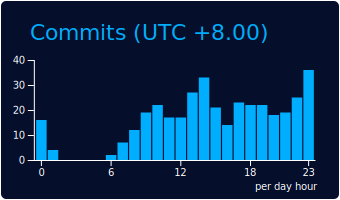
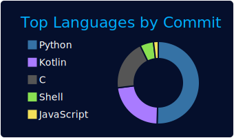
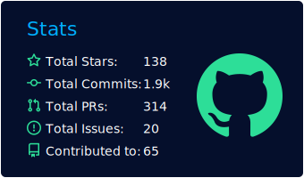

<div align="center">





<picture>
  <source media="(prefers-color-scheme: dark)" srcset="snk/snk-dark.svg" />
  <source media="(prefers-color-scheme: light)" srcset="snk/snk.svg" />
  
</picture>


</div>

# About me
- Hi!I'm @luyanci!

- This is my video channel:[](https://space.bilibili.com/282873551)
- My blog website:[github page](https://luyanci.github.io) and the status:[](https://github.com/luyanci/luyanci.github.io/actions/workflows/pages.yml)

<div align="right">



</div>

## Other info
<!-- steam-box start -->
🎮 Steam playtime leaderboard
```text
🎮 PC Building Simulator            🕘 58 hrs 33 mins
🎮 Senren＊Banka                    🕘 32 hrs 33 mins
🎮 Hacknet                          🕘 30 hrs 55 mins
🎮 Amairo Chocolate 3               🕘 15 hrs 33 mins
🎮 Live2DViewerEX                   🕘 12 hrs 16 mins
```
<!-- Powered by https://github.com/YouEclipse/steam-box . -->
<!-- steam-box end -->
 
<div align="center">


</div>


 


<!---
luyanci/luyanci is a ✨ special ✨ repository because its `README.md` (this file) appears on your GitHub profile.
You can click the Preview link to take a look at your changes.
--->
